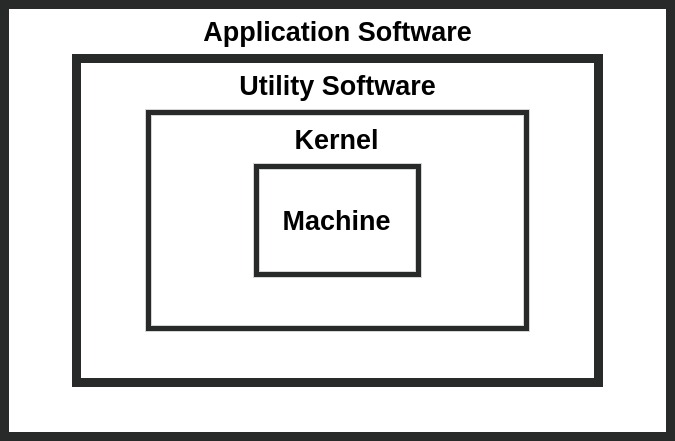

[**_``Go Back``_**](../README.md)

# Introduction to Operating System

## History
---------------------
Early computers were built to perform a series of single tasks, like a calculator. Basic operating system features were developed in the 1950s, such as ``resident monitor`` functions that could automatically run different programs in succession to speed up processing. Operating systems did not exist in their modern and more complex forms until the early 1960s. Hardware features were added, that enabled use of runtime libraries, interrupts, and parallel processing. When personal computers became popular in the 1980s, operating systems were made for them similar in concept to those used on larger computers.

In the 1940s, the earliest electronic digital systems had no operating systems. Electronic systems of this time were programmed on rows of mechanical switches or by jumper wires on plugboards. These were special-purpose systems that, for example, generated ballistics tables for the military or controlled the printing of payroll checks from data on punched paper cards. After programmable general-purpose computers were invented, machine languages(consisting of strings of the binary digits 0 and 1 on punched paper tape) were introduced that sped up the programming process (Stern, 1981).

In the early 1950s, a computer could execute only one program at a time. Each user had sole use of the computer for a limited period and would arrive at a scheduled time with their program and data on punched paper cards or punched tape. The program would be loaded into the machine, and the machine would be set to work until the program completed or crashed. Programs could generally be debugged via a front panel using toggle switches and panel lights. It is said that ``Alan Turing`` was a master of this on the early ``Manchester Mark 1`` machine, and he was already deriving the primitive conception of an operating system from the principles of the ``Universal Turing Machine``.

Later machines came with libraries of programs, which would be linked to a user's program to assist in operations such as input and output and compiling``(generating machine code from human-readable symbolic code)``. This was the genesis of the modern-day operating system. However, machines still ran a single job at a time. At Cambridge University in England, the job queue was at one time a washing line (clothesline) from which tapes were hung with different colored clothes-pegs to indicate job priority.

An improvement was the ``Atlas Supervisor``. Introduced with the Manchester ``Atlas`` in 1962, it is considered by many to be the first recognisable modern operating system. ``Brinch Hansen`` described it as "the most significant breakthrough in the history of operating systems"

## Introduction and Generation of Operating System
----------------------------------------------------

### **Introduction to Operating System**

An ``Operating System (OS)`` is system software that manages computer hardware, software resources, and provides common services for computer programs.

An ``Operating System (OS)`` is a large collection of system software, which manages the resources of computer system such as ``memory``, ``storage``, ``processor``, ``I/O devices`` and it also acts as an interface between machine and user. Moreover, it also performs the basic tasks such as reorganization of peripherial devices, sending-recieving information to the external sources keeping task of files, folders on the disk and other different utility task.

The organization or architecture of OS deals with the internal structure of OS, mainly is divided into 3 layers as shown in figure below:

>Fig: Architecture of Operating System

- **``Kernel``**: A main part of OS always remains in the main memory during the running of computer called ``kernel``. It is the main controlling part of OS which controls all running programs and hardware resources.

- **``Utility Software``**: Outside this layer, there is a set of utility programs which are used as a system management tool, also known as house keeping work of OS. Utility programs help manage, maintain and control computer resources. These programs are available to help you with the day-to-day chores associated with personal computing and to keep your system running at peak performance.

- **``Application Software``**: Application software is developed in order to fulfill user requirements. It enables user to accomplish certain specific task. It can useto solve application type of problems. Business software, Database software, and educational software are some forms of application software. Other application software is word processors, spreadsheet ,presentation packages etc. ``Application software`` utilizes the capacity of a computer directly to a dedicated task.

### **Generation of Operating System**

``Operating Systems`` have evolved over the years. So, their evolution through the years can be mapped using generations of operating systems. There are four generations of operating systems. These can be described as follows :

-   **The First Generation ( 1945 - 1955 ) ``Vacuum Tubes and Plugboards``**
-   **The Second Generation ( 1955 - 1965 ) ``Transistors and Batch Systems``**
-   **The Third Generation ( 1965 - 1980 ) ``Integrated Circuits and Multiprogramming``**
-   **The Fourth Generation ( 1980 - Present ) ``Personal Computers``**

**Explanation:**

#### **The First Generation ( 1945 - 1955 ) ``Vacuum Tubes and Plugboards``**

Digital computers were not constructed until the second world war.Calculating engines with mechanical relays were built at that time. However, the mechanical relays were very slow and were later replaced with vacuum tubes. These machines were enormous but were still very slow.

These early computers were designed, built and maintained by a single group of people. Programming languages were unknown and there were no operating systems so all the programming was done in machine language. All the problems were simple numerical calculations.

By the 1950’s punch cards were introduced and this improved the computer system. Instead of using plugboards, programs were written on cards and read into the system.

#### **The Second Generation ( 1955 - 1965 ) ``Transistors and Batch Systems``**

Transistors led to the development of the computer systems that could be manufactured and sold to paying customers. These machines were known as mainframes and were locked in air-conditioned computer rooms with staff to operate them.

The ``Batch System`` was introduced to reduce the wasted time in the computer. A tray full of jobs was collected in the input room and read into the magnetic tape. After that, the tape was rewound and mounted on a tape drive. Then the batch operating system was loaded in which read the first job from the tape and ran it. The output was written on the second tape. After the whole batch was done, the input and output tapes were removed and the output tape was printed.

#### **The Third Generation ( 1965 - 1980 ) ``Integrated Circuits and Multiprogramming``**

Until the 1960’s, there were two types of computer systems i.e the scientific and the commercial computers. These were combined by IBM in the System/360. This used integrated circuits and provided a major price and performance advantage over the second generation systems.

The third generation operating systems also introduced multiprogramming. This meant that the processor was not idle while a job was completing its I/O operation. Another job was scheduled on the processor so that its time would not be wasted.

#### **The Fourth Generation ( 1980 - Present ) ``Personal Computers``**

Personal Computers were easy to create with the development of large-scale integrated circuits. These were chips containing thousands of transistors on a square centimeter of silicon. Because of these, microcomputers were much cheaper than minicomputers and that made it possible for a single individual to own one of them.

The advent of personal computers also led to the growth of networks. This created network operating systems and distributed operating systems. The users were aware of a network while using a network operating system and could log in to remote machines and copy files from one machine to another.

## Objectives
-----------------

- ``Convenience``: An OS makes a computer more convenient to use.

- ``Efficiency``: An OS allows the computer system resources to be used in an efficient manner.

- ``Ability to evolve``: An OS should be constructed in such a way as to permit the effective development, testing, and introduction of new system functions without interfering with service.

## Types of Operating System
------------------------------

- **Based on Processing Method**
    - ``Multiprogramming``
    - ``Multitasking``
    - ``Multiprocessing``
    - ``Real-time System``
    - ``Time sharing management``
    - ``Batch processing OS``
    - ``Network and Distributed System``
    - ``On-line Processing``

- **Based on User Interface**
    - ``Graphical User Interface (GUI)``
    - ``Character User Interface (CUI)``

- **Based on Mode of User**
    - ``Single user OS``
    - ``Multi user OS``

**Explanation:**

### **Based on Processing Method**

#### ``Multiprogramming``

Multiprogramming allows execution of two or more programs in main memory of the computer. In this environment, processor processes several programs simultaneously.

> Maximum utilization of ``CPU`` keeping it busy is called ``Multiprogramming`` or ``Concurrent Programming``. 

All the programs are kept in the job pool of mass storage devices and these programs are ready for processing but ``CPU`` is busy, so these programs are waiting their turns. When one processing is completed, next ready program is fetched from main memory for processing. 

#### ``Multitasking``

A system able to process a number of tasks (programs) at a time is called multitasking. It allows more than one program to run concurrently.

> Multitasking computers are executing several tasks or programs at a same time.

In multitasking, only one ``CPU`` is involved, but it switches from one program to another so quickly that it gives the appearance of executing all of the programs at a same time. In this system, more than one task is performed on the priority basis, a high priority task interrupts low priority task. There are two basic types of multitasking:

- ``Pre-emptive`` 
- ``Non-pre-emptive``

In ``pre-emptive multitasking``, the os allows CPU time slices to each program .

In ``non-pre-emptive multitasking``, each program can control the CPU for as long as it needs. If a program is not using the ``CPU``, however, it can allow another program to use it temporarily. It is also called ``cooperative multitasking``. 

#### ``Multiprocessing``

The CPU of any computer is called processor. ``Multiprocessing operating system`` is the one which runs on the computer having more than one processor and all these processor share some or all of the same memory. Such OS simultaneously executes two or more jobs at a single time.

> Multiprocessing has more than one processor, linked together in a coordinate way with multiple CPU and common memory.

``Multiprocessing`` systems are much more complicated than single-process systems, because the OS must allocate resources to competing processes in a reasonable manner. This is also called ``parellel processing``.

#### ``Real-time System``

``Real-time operating systems`` are systems are systems that respond to input immediately. This category includes OS designed substantially for the purpose of controlling and monitoring external activities with timing constraints.

> ``Real time OS`` is method which controls environment by receiving data, processing them and taking action quickly at that time.

They are used for those task, in which computer must react to a steady flow of new information without interruption. Most general-purpose operating systems like ``DOS`` and ``UNIX`` are not real-time because they can take a few seconds or even minutes, to react. It is fast and predictable computing. 

#### ``Time sharing management``

In ``time-sharing system``, the ``CPU`` executes multiple jobs by switching among them, but the switches occur so frequently that the users can interact with each program while it is running. The user gives instructions to the OS or to the program directly, using an imput device such as a keyboard or amouse and waits for immediate results on an output device. Accordingly, the response time should be short-typically less than one second.

#### ``Batch processing OS``

``Batch processing system`` works as an operating system. ``Batch processing system`` means to grab all types of programs and data in the batch form then proceed to process. Main motive of using batch processing system is to decrease the set up time while submitting the similar jobs to CPU.

#### ``Network and Distributed System``

``Network Operating System`` is a computer operating system that facilitates to connect and communicate various autonomous computers over a network. An Autonomous computer is an independent computer that has its own local memory, hardware, and O.S.

#### ``On-line Processing``

The ``on-line processing`` is a fast processing in which input device is directly connected to computer. In the system, data transaction is available immediately. So, computers operations are carried on prompt ly as the event occur .No need to wait for a long time to execute any operation. It is fast but not predectable computing.

### **Based on User Interface**

#### ``Graphical User Interface (GUI)``

``GUI`` allows you to enter commands by pointing and clicking at objects that appers on the screen. The main advantage of ``GUI`` is that it is easy to use. The disadvantage of GUI is the amount of memory space they need. It needs a lot of RAM and disk space to run. For eg: Windows

#### ``Character User Interface (CUI)``

``Command line Interface (CLI)/Text Base Interface (TBI)/Character User Interface(CUI)``, where the user provides the input by typing a command string with the computer keyboard and the system provides output by printing text on the computer monitor. The main advantage of ``CLI`` is that they can be quick to use. The disadvantage of CLI is that they are very difficult to use if the user don`t know the correct command. ``DOS`` is the commonly used example of ``CUI``. 

### **Based on Mode of User**

#### ``Single user OS``

``Single-user operating system`` allows one user at a time. Normally, one user program is only allowed to be run and processed at a time. So, there is no multiprogramming of user programs. It is based on small microcomputer which allows a single user to operate the machine. Examples are ``MS-DOS``, ``PC-DOS`` etc. 

#### ``Multi user OS``

``Multiple-user operating system`` allows two or more users to run programs at the same time. Some operationg systems permit hundreds or even thousands of concurrent users. The operating systems of ``mainframes`` and ``minicomputers`` are multi-user systems. Examples are ``UNIX``, ``Linux`` etc

## Function of Operating System
---------------------------------

The functions of ``operating systems`` are:

- ``Input Output (I/O) management``
- ``File management``
- ``Memory management``
- ``Process management``
- ``Interrupt-handeling``
- ``Deadlock prevention``
- ``Security management``
- ``User interface``

**Explanation:**

### **Input Output (I/O) management**
OS manages the input and output of computer. This applies to the flow of data among computers, terminal and other devices such as monitors ,printers etc. Application programs use the operating system extensively to handle input and output devices as needed.

### **File management**
File management creates a mechanism of files and directories by making table of each file and directories in the storage devices, so as to keep track of each element. Then it implements different type's efficient searching mechanism of files. 

The operating system like window manages the disk with ``FAT``, ``FAT 32`` or ``NTFS`` file system. ``FAT`` is short form of ``File Allocation Table`` .The ``FAT`` has the information about the filname, file size, date and time creation and allocation on the disk spaces. ``NTFS``stands for ``Nee Technology File System``. It has several improvement over ``FAT`` and support for the use of advanced data structures to improve performance, reliability, and disk space utilization, plus additional extensions, such as security. 

### **Memory management**
Computer System includes number of storage devices like registers cache memory, primary memory, secondary memory etc. Whenever,processor needs some data or instructions, it is first searched in registers and the after cache memory, if it isn`t available there, then it looks into the RAM. If still not available, then data is brought into main mamory from hard disk. So, the way of loading, accessing and removing the data from these devices are managed by the operating system 

### **Process management**
A process is a program, which is currently in ``ready`` / ``running`` / ``blocked`` state (that is current loading in the main memory).There can be only one program, but there may be multiple processes of same program.

When multiple processes are running , some process may demand the input/output devices. In such case the process goes to the blocked state until the device is available. When concurrent processes are under execution, the CPU time can be given to a single process at a time. The process which gets the CPU time is in the ready state.

One of the major task of an OS module is to manage and schedule the task efficiently, which is performed by processor. So, main activities of process management are job queuing, job scheduling, keeping track of the status of each process etc.

### **Interrupt-handeling**

Interrupt is an event that alerts the sequence in which the processor executes instructions.

OS provides a feature ``interrupter handler`` which are the routines that are called when an interrupt is detected.

### **Deadlock prevention**

Sometimes, during a proccess, a situation is arising in which resource either hardware or software, shared by two or more processes (for example, printer) cannot continue because the resource required by a process is held by another resource. In this situation, both jobs are conflict by resources. So, such type of situation or condition is called ``deadlock``.
Such condition are avoided by OS. For that, it takes suitable action by careful allocation of resources.

