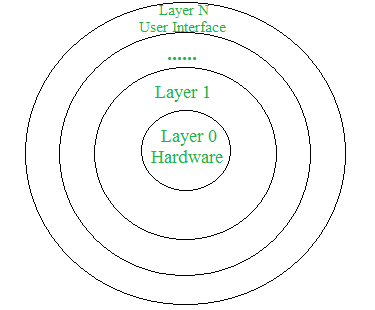

[**_``Go Back``_**](../README.md)

# Operating System Structure

## Introduction

The operating system structure illustrates the organization of modules inside it. The structure of the operating system varies from system to system. Engineers design it more carefully. So that the operating system functions properly and adopts the modification easily.

**Types of Operating System Structure**

## Layered Structure

An OS can be broken into pieces and retain much more control on system. In this structure the OS is broken into number of layers (levels). The bottom layer (layer 0) is the hardware and the topmost layer (layer N) is the user interface. These layers are so designed that each layer uses the functions of the lower level layers only. This simplifies the debugging process as if lower level layers are debugged and an error occurs during debugging then the error must be on that layer only as the lower level layers have already been debugged. 

The main disadvantage of this structure is that at each layer, the data needs to be modified and passed on which adds overhead to the system. Moreover careful planning of the layers is necessary as a layer can use only lower level layers. UNIX is an example of this structure. 

**Advantages of Layered structure:**

- Layering makes it easier to enhance the operating system as implementation of a layer can be changed easily without affecting the other layers.

- It is very easy to perform debugging and system verification.

**Disadvantages of Layered structure:**

- In this structure the application performance is degraded as compared to simple structure.

- It requires careful planning for designing the layers as higher layers use the functionalities of only the lower layers.

## Kernel

``Kernel`` is central component of an operating system that manages operations of computer and hardware. It basically manages operations of memory and CPU time. It is core component of an operating system. ``Kernel`` acts as a bridge between applications and data processing performed at hardware level using inter-process communication and system calls. 

``Kernel`` loads first into memory when an operating system is loaded and remains into memory until operating system is shut down again. It is responsible for various tasks such as disk management, task management, and memory management. 

It decides which process should be allocated to processor to execute and which process should be kept in main memory to execute. It basically acts as an interface between user applications and hardware. The major aim of kernel is to manage communication between software i.e. user-level applications and hardware i.e., CPU and disk memory. 

**Objectives of Kernel:** 

- To establish communication between user level application and hardware. 
- To decide state of incoming processes.
- To control disk management.
- To control memory management.
- To control task management.

## Types of kernel

**Types of ``Kernel`` are :**

- ``Monolithic Kernel``
- ``Macro Kernel``
- ``Micro Kernel``
- ``Exo Kernel``

### **Monolithic Kernel**

It is one of types of kernel where all operating system services operate in kernel space. It has dependencies between systems components. It has huge lines of code which is complex. Example Unix, Linux etc

Advantage : 
- It has good performance. 

Disadvantage : 
- It has dependencies between system component and lines of code in millions. 

### **Macro Kernel**

Macrokernel is a special Operation System core that provides multiple and high-end services and resources to the user as well as the system. Macrokernel is generally used in supercomputers, hybrid computer and high-end processing equipment.

### **Micro Kernel**

It is kernel types which has minimalist approach. It has virtual memory and thread scheduling. It is more stable with less services in kernel space. It puts rest in user space. Example AmigaOS, Minix etc

Advantage : 
- It is more stable. 
 

Disadvantage : 
- There are lots of system calls and context switches. 

### **Exo Kernel**

It is the type of kernel which follows end-to-end principle. It has fewest hardware abstractions as possible. It allocates physical resources to applications. Example Nemesis, ExOS etc.

Advantage : 
- It has fewest hardware abstractions. 
 

Disadvantage : 
- There is more work for application developers.

## Client-Server Model

> todo

## Virtual Machines

``Virtual Machine`` abstracts the hardware of our personal computer such as CPU, disk drives, memory, NIC (Network Interface Card) etc, into many different execution environments as per our requirements, hence giving us a feel that each execution environment is a single computer. For example, VirtualBox.

**Advantages:**

- There are no protection problems because each virtual machine is completely isolated from all other virtual machines.

- Virtual machine can provide an instruction set architecture that differs from real computers.

- Easy maintenance, availability and convenient recovery.

**Disadvantages:**

- When multiple virtual machines are simultaneously running on a host computer, one virtual machine can be affected by other running virtual machines, depending on the workload.

- Virtual machines are not as efficient as a real one when accessing the hardware.

## Shell

In computing, a shell is a computer program which exposes an operating system's services to a human user or other programs. In general, operating system shells use either a command-line interface (CLI) or graphical user interface (GUI), depending on a computer's role and particular operation. It is named a shell because it is the outermost layer around the operating system.