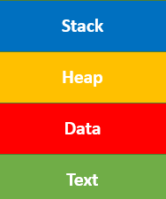

[**_``Go Back``_**](../README.md)

# Process Management

``Process management`` involves various tasks like ``creation``, ``scheduling``, ``termination`` of processes, and a dead lock. Process is a program that is under execution, which is an important part of modern-day operating systems. The OS must allocate resources that enable processes to share and exchange information. It also protects the resources of each process from other methods and allows ``synchronization`` among processes.

It is the job of OS to manage all the running processes of the system. It handles operations by performing tasks like process scheduling and such as resource allocation.

## **Process Concept**

### Defination of Process
---------------------------

``Process`` is the execution of a program that performs the actions specified in that program. It can be defined as an execution unit where a program runs. The OS helps you to ``create``, ``schedule``, and ``terminates`` the processes which is used by ``CPU``. A process created by the main process is called a child process.

Process operations can be easily controlled with the help of ``PCB (Process Control Block)``. You can consider it as the brain of the process, which contains all the crucial information related to processing like process id, priority, state, CPU registers, etc.

Here, is an Architecture diagram of the Process

- ``Stack``: The Stack stores temporary data like function parameters, returns addresses, and local variables.

- ``Heap``: Heap Allocates memory, which may be processed during its run time.

- ``Data``: It contains the variable.

- ``Text``: Text Section includes the current activity, which is represented by the value of the Program Counter.

### The Process Model
-----------------------

In ``process model``, all the runnable software on the computer, is organized into a number of sequential processes. Each process has its own virtual ``Central Processing Unit (CPU)``.

The real ``Central Processing Unit (CPU)`` switches back and forth from process to process. This work of switching back and forth is called multiprogramming.

A process is basically an activity. It has a program, input, output, and a state.

### The Process State
-----------------------

States of a process are as following:

- ``NEW``: A program which is going to be picked up by the OS into the main memory is called a new process.

- ``READY``: Whenever a process is created, it directly enters in the ready state, in which, it waits for the CPU to be assigned. The OS picks the new processes from the secondary memory and put all of them in the main memory.The processes which are ready for the execution and reside in the main memory are called ready state processes. There can be many processes present in the ready state.

- ``RUNNING``: One of the processes from the ready state will be chosen by the OS depending upon the scheduling algorithm. Hence, if we have only one CPU in our system, the number of running processes for a particular time will always be one. If we have n processors in the system then we can have n processes running simultaneously.

- ``WAITING``: From the Running state, a process can make the transition to the block or wait state depending upon the scheduling algorithm or the intrinsic behavior of the process. When a process waits for a certain resource to be assigned or for the input from the user then the OS move this process to the block or wait state and assigns the CPU to the other processes.

- ``TERMINATED``: When a process finishes its execution, it comes in the termination state. All the context of the process (Process Control Block) will also be deleted the process will be terminated by the Operating system.

### Process State Transaction
-----------------------------

>todo

### The Process Control Block (PCB)
-----------------------------

It is a data structure that is maintained by the Operating System for every process. The ``PCB`` should be identified by an integer Process ID (PID). It helps you to store all the information required to keep track of all the running processes.

>Process Control block (PCB) is a data structure that stores information of a process.

It is also accountable for storing the contents of processor registers. These are saved when the process moves from the running state and then returns back to it. The information is quickly updated in the ``PCB`` by the ``OS`` as soon as the process makes the state transition.

#### **Structure of the Process Control Block**

The PCB stores many data items that are needed for efficient process management. Some of these data items are explained with the help of the given diagram :

``Process state:`` A process can be new, ready, running, waiting, etc.

``Program counter:`` The program counter lets you know the address of the next instruction, which should be executed for that process.

``CPU registers:`` This component includes accumulators, index and general-purpose registers, and information of condition code.

``CPU scheduling information:`` This component includes a process priority, pointers for scheduling queues, and various other scheduling parameters.

``Accounting and business information:`` It includes the amount of CPU and time utilities like real time used, job or process numbers, etc.

``Memory-management information:`` This information includes the value of the base and limit registers, the page, or segment tables. This depends on the memory system, which is used by the operating system.

``I/O status information:`` This block includes a list of open files, the list of I/O devices that are allocated to the process, etc.

#### **Role of Process Control Block**

It's the job of the operating system to assign a ``CPU`` to a process as the process doesn't need a ``CPU`` all the time. Let's take an example of the input/output process, they are only used by the ``CPU`` when triggered.

The role of ``PCB`` arises as an identification card of each process. The Operating System doesn't know which process is which, until Operating System refers through the PCB of every process. For example, there are MS word process, pdf process, printing process, and many background processes are running currently on the ``CPU``. How will OS identify and manage each process without knowing the identity of each process?

So, here ``PCB`` comes into play as a data structure to store information of each process.

Therefore, whenever a user triggers a process (like print command), a process control block (PCB) is created for that process in the operating system which is used by the operating system to execute and manage the processes when the operating system is free.

---------------------------------------------------
>todo
