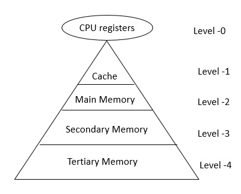
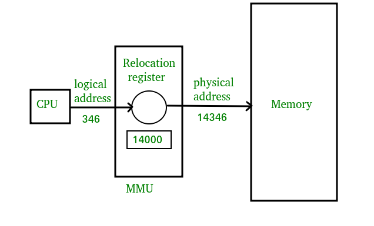

[**_``Go Back``_**](../README.md)

# Memory Management

## Basic Memory Management

### Introduction
-----------------------

The term Memory can be defined as a collection of data in a specific format. It is used to store instructions and processed data. The memory comprises a large array or group of words or bytes, each with its own location. The primary motive of a computer system is to execute programs. These programs, along with the information they access, should be in the main memory during execution. The CPU fetches instructions from memory according to the value of the program counter. 

To achieve a degree of multiprogramming and proper utilization of memory, memory management is important. Many memory management methods exist, reflecting various approaches, and the effectiveness of each algorithm depends on the situation. 

### Memory Hierarchy
-----------------------

The Computer memory hierarchy looks like a pyramid structure which is used to describe the differences among memory types. It separates the computer storage based on hierarchy.

In Memory Hierarchy the cost of memory, capacity is inversely proportional to speed. Here the devices are arranged in a manner Fast to slow, that is form register to Tertiary memory.

#### **Level-0 − Registers**
The registers are present inside the CPU. As they are present inside the CPU, they have least access time. Registers are most expensive and smallest in size generally in kilobytes. They are implemented by using Flip-Flops.

#### **Level-1 − Cache**

Cache memory is used to store the segments of a program that are frequently accessed by the processor. It is expensive and smaller in size generally in Megabytes and is implemented by using static RAM.

#### **Level-2 − Primary or Main Memory**

It directly communicates with the CPU and with auxiliary memory devices through an I/O processor. Main memory is less expensive than cache memory and larger in size generally in Gigabytes. This memory is implemented by using dynamic RAM.

#### **Level-3 − Secondary storage**

Secondary storage devices like Magnetic Disk are present at level 3. They are used as backup storage. They are cheaper than main memory and larger in size generally in a few TB.

#### **Level-4 − Tertiary storage**

Tertiary storage devices like magnetic tape are present at level 4. They are used to store removable files and are the cheapest and largest in size (1-20 TB).

**We can infer the following characteristics of Memory Hierarchy Design from above figure:**

- ``Capacity``: It is the global volume of information the memory can store. As we move from top to bottom in the Hierarchy, the capacity increases.

- ``Access Time``: It is the time interval between the read/write request and the availability of the data. As we move from top to bottom in the Hierarchy, the access time increases.

- ``Performance``: Earlier when the computer system was designed without Memory Hierarchy design, the speed gap increases between the CPU registers and Main Memory due to large difference in access time. This results in lower performance of the system and thus, enhancement was required. This enhancement was made in the form of Memory Hierarchy Design because of which the performance of the system increases. One of the most significant ways to increase system performance is minimizing how far down the memory hierarchy one has to go to manipulate data.

- ``Cost per bit``: As we move from bottom to top in the Hierarchy, the cost per bit increases i.e. Internal Memory is costlier than External Memory.

### Logical Vs Physical Address Space
--------------------------------------

#### Logical Address Space
``Logical Address`` is generated by CPU while a program is running. The logical address is virtual address as it does not exist physically, therefore, it is also known as Virtual Address. This address is used as a reference to access the physical memory location by CPU. The term Logical Address Space is used for the set of all logical addresses generated by a program’s perspective. 
The hardware device called Memory-Management Unit is used for mapping logical address to its corresponding physical address. 

#### Physical Address Space
``Physical Address`` identifies a physical location of required data in a memory. The user never directly deals with the physical address but can access by its corresponding logical address. The user program generates the logical address and thinks that the program is running in this logical address but the program needs physical memory for its execution, therefore, the logical address must be mapped to the physical address by MMU before they are used. The term Physical Address Space is used for all physical addresses corresponding to the logical addresses in a Logical address space.

|  Parameter  |                               LOGICAL ADDRESS                                                  |                                  PHYSICAL ADDRESS                                              |
|-------------|------------------------------------------------------------------------------------------------|------------------------------------------------------------------------------------------------|
|Basic        |generated by CPU                                                                                |location in a memory unit                                                                       |
|Address Space|Logical AddressSpace is set of all logical addresses generated by CPU in reference to a program.|Physical Address is set of all physical addresses mapped to the corresponding logical addresses.|
|Visibility   |User can view the logical address of a program.                                                 |User can never view physical address of program.                                                |
|Generation   |generated by the CPU                                                                            |Computed by MMU                                                                                 |
|Access       |The user can use the logical address to access the physical address.                            |The user can indirectly access physical address but not directly.                               |
|Editable     |Logical address can be change.                                                                  |Physical address will not change.                                                               |
|Also called  |virtual address.                                                                                |real address.                                                                                   |

### Memory Management With Swaping
--------------------------------------
Swapping is a mechanism in which a process can be swapped temporarily out of main memory (or move) to secondary storage (disk) and make that memory available to other processes. At some later time, the system swaps back the process from the secondary storage to main memory.

Though performance is usually affected by swapping process but it helps in running multiple and big processes in parallel and that's the reason ``Swapping is also known as a technique for memory compaction``.

#### Memory Management with Bitmap
