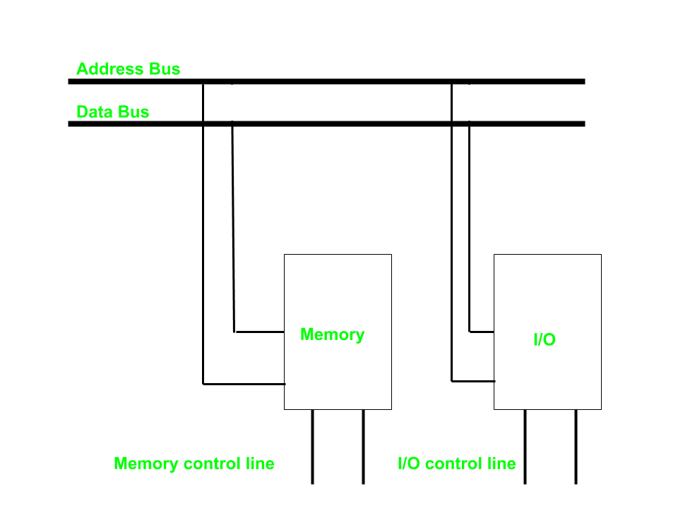
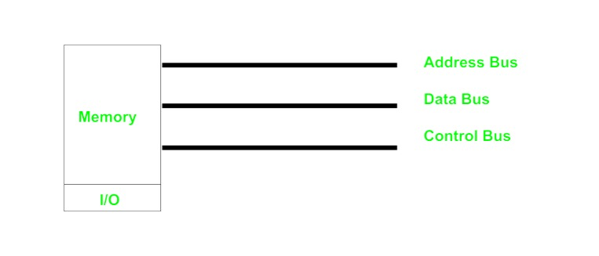

[**_``Go Back``_**](../README.md)

# Input/Output Device Management

## Principales of I/O Hardware:

One of the important jobs of an Operating System is to manage various I/O devices including mouse, keyboards, touch pad, disk drives, display adapters, USB devices, Bit-mapped screen, LED, Analog-to-digital converter, On/off switch, network connections, audio I/O, printers etc.

An I/O system is required to take an application I/O request and send it to the physical device, then take whatever response comes back from the device and send it to the application.

### I/O Devices: 

An Input/Output device, often known as an IO device, is any hardware that allows a human operator or other systems to interface with a computer. Input/output devices, as the name implies, are capable of delivering data (output) to and receiving data from a computer (input).

An Input/Output (I/O) device is a piece of hardware that can take, output, or process data. It receives data as input and provides it to a computer, as well as sends computer data to storage media as a storage output.

I/O devices can be divided into two categories:

- ``Block devices`` − A block device is one with which the driver communicates by sending entire blocks of data. For example, Hard disks, USB cameras, Disk-On-Key etc.

- ``Character devices`` − A character device is one with which the driver communicates by sending and receiving single characters (bytes, octets). For example, serial ports, parallel ports, sounds cards etc

### Device Controller:

Device drivers are software modules that can be plugged into an OS to handle a particular device. Operating System takes help from device drivers to handle all I/O devices.

The Device Controller works like an interface between a device and a device driver. I/O units (Keyboard, mouse, printer, etc.) typically consist of a mechanical component and an electronic component where electronic component is called the device controller.

There is always a device controller and a device driver for each device to communicate with the Operating Systems. A device controller may be able to handle multiple devices. As an interface its main task is to convert serial bit stream to block of bytes, perform error correction as necessary.

Any device connected to the computer is connected by a plug and socket, and the socket is connected to a device controller.

### Memory Mapped I/O and Isolated I/O

As a CPU needs to communicate with the various memory and input-output devices (I/O) as we know data between the processor and these devices flow with the help of the system bus. There are three ways in which system bus can be allotted to them :

- Separate set of address, control and data bus to I/O and memory.
- Have common bus (data and address) for I/O and memory but separate control lines.
- Have common bus (data, address, and control) for I/O and memory.
- In first case it is simple because both have different set of address space and instruction but require more buses.

### **Isolated I/O**
Then we have Isolated I/O in which we Have common bus(data and address) for I/O and memory but separate read and write control lines for I/O. So when CPU decode instruction then if data is for I/O then it places the address on the address line and set I/O read or write control line on due to which data transfer occurs between CPU and I/O. As the address space of memory and I/O is isolated and the name is so. The address for I/O here is called ports. Here we have different read-write instruction for both I/O and memory.

### **Memory Mapped I/O**
In this case every bus in common due to which the same set of instructions work for memory and I/O. Hence we manipulate I/O same as memory and both have same address space, due to which addressing capability of memory become less because some part is occupied by the I/O.

## Direct Memory Access

DMA Controller is a hardware device that allows I/O devices to directly access memory with less participation of the processor. DMA controller needs the same old circuits of an interface to communicate with the CPU and Input/Output devices. 

**DMA controller registers**

The DMA controller has three registers as follows.

- ``Address register`` : It contains the address to specify the desired location in memory.
- ``Word count register`` : It contains the number of words to be transferred.
- ``Control register`` : It specifies the transfer mode.

>todo